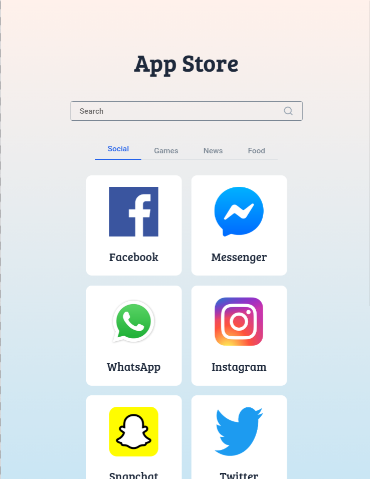

📑 Contents

- [Overview](#-overview)
- [Features](#-features)
- [Concepts Practiced](#-concepts-practiced)
- [Screenshots](#-screenshots)
- [Project Structure](#-project-structure)
- [Getting Started](#-getting-started)
- [Tech Stack](#-tech-stack)
- [Notes](#-notes)
- [Author](#-author)

---

## 📌 Overview

The App Store project displays a collection of applications grouped by categories.  
Users can search for apps using a text input and filter them based on selected tabs or categories.

This project reinforces common UI patterns such as search, filtering, and dynamic list rendering in React.

---

## ✨ Features

- Displays a list of applications
- Category-based filtering using tabs
- Search apps using a case-insensitive input
- Dynamic rendering based on user interaction
- Clean and structured UI

---

## 🧠 Concepts Practiced

- Controlled input elements
- List filtering with `filter`
- Conditional rendering
- Parent–child component communication
- State-driven UI updates

---

## 🖼️ Screenshots





---

## 📁 Project Structure

src/
├── components/
│ ├── AppStore/
│ ├── AppItem/
│ └── TabItem/
├── App.js
└── index.js


---

## 🚀 Getting Started

### Install dependencies
```bash
npm install

Start the development server

npm start

Runs at: http://localhost:3000
🛠️ Tech Stack

    React (Create React App)

    JavaScript (ES6+)

    CSS

    Testing Library

📌 Notes

    Designed to satisfy strict testing requirements

    Focused on correct filtering logic and UI behavior

    Emphasizes clarity and predictable data flow

👤 Author

Built as part of Daily Code 2026
Maintained by Guneshbari
