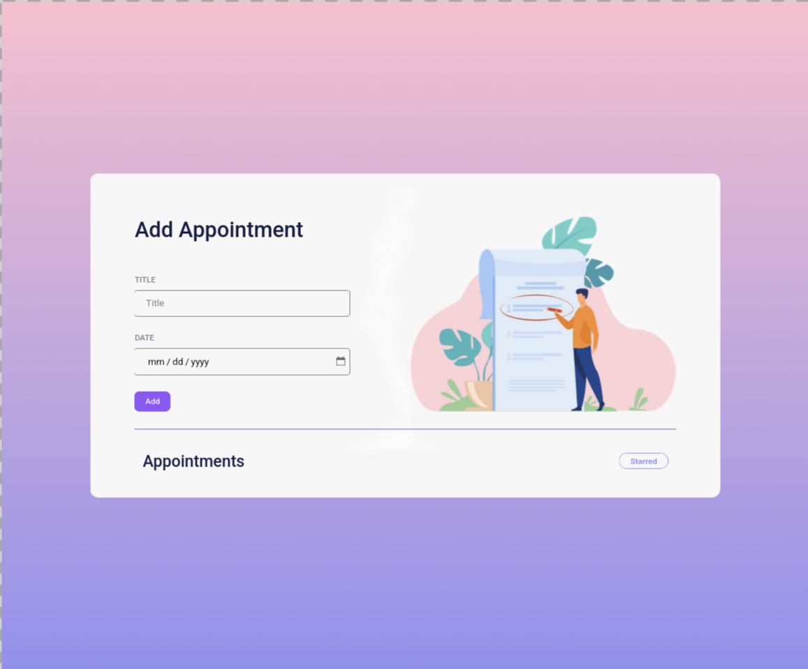
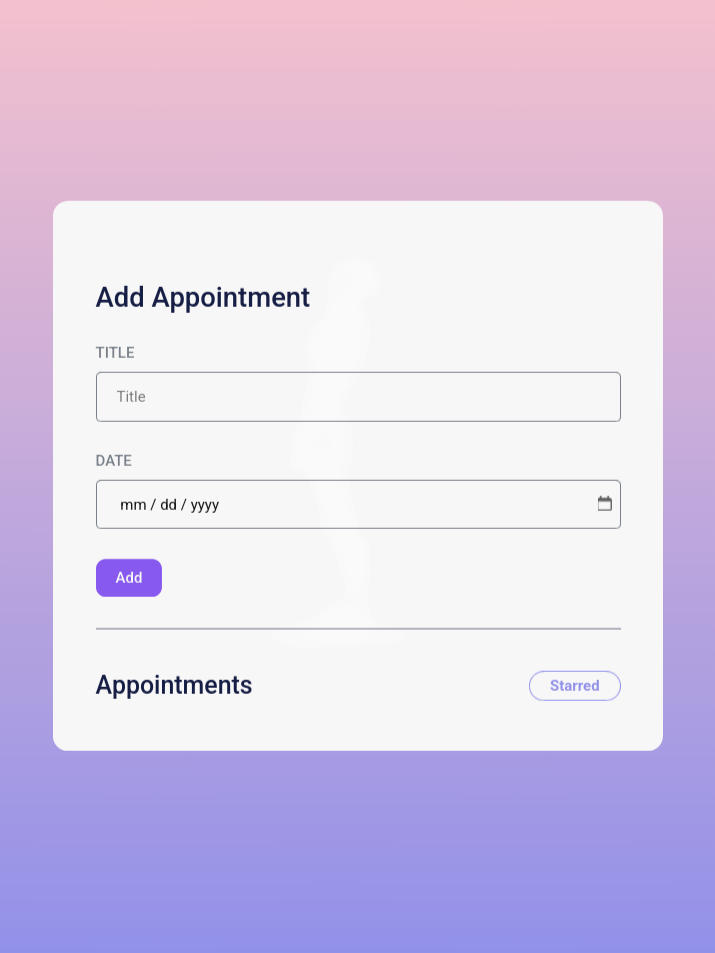

# Appointments App

  
  
  
  

  
  

A React application that allows users to add appointments, mark them as starred, and filter appointments based on their starred status.

Built as part of **Daily Code 2026**, focusing on form handling, list management, and state-driven filtering.

---

## 📑 Contents

- Overview  
- Features  
- App Logic  
- Concepts Practiced  
- Screenshots  
- Project Structure  
- Getting Started  
- Tech Stack  
- Notes  
- Author  

---

## 📌 Overview

The Appointments App enables users to create appointments by providing a title and date.  
Appointments can be starred, and users can filter the list to view only starred appointments.

This project reinforces controlled inputs, immutable state updates, and conditional rendering patterns in React.

---

## ✨ Features

- Add appointments using title and date inputs  
- Clear input fields after submission  
- Star and unstar appointments  
- Filter appointments by starred status  
- Dynamic list rendering with real-time updates  

---

## 🎯 App Logic

- Appointments list is initially empty  
- Title and date inputs are controlled components  
- On clicking **Add** with valid inputs:
  - A new appointment is added to the list
  - Inputs reset to initial empty values
- Clicking the star icon toggles the starred status
- Clicking **Starred** filter:
  - Shows only starred appointments when active
  - Shows all appointments when inactive
- Dates are formatted using:
  
  format string: `dd MMMM yyyy, EEEE`

---

## 🧠 Concepts Practiced

- Controlled form elements  
- React state management  
- List rendering with unique keys  
- Conditional filtering  
- Parent–child communication via props  
- Event handling  

---

## 🖼️ Screenshots

  
  

---

## 📁 Project Structure

src/
├── components/
│   ├── Appointments/
│   │   ├── index.js
│   │   └── index.css
│   └── AppointmentItem/
│       ├── index.js
│       └── index.css
├── App.js
└── index.js

---

## 🚀 Getting Started

Install dependencies:

npm install

Start the development server:

npm start

Runs at: http://localhost:3000

---

## 🛠️ Tech Stack

- React (Create React App)  
- JavaScript (ES6+)  
- CSS  
- date-fns  
- Testing Library  

---

## 📌 Notes

- Appointments list starts empty  
- Star button must include `data-testid="star"`  
- Star image must have `alt="star"`  
- Date formatting must use `dd MMMM yyyy, EEEE`  
- Designed to satisfy strict testing requirements  

---

## 👤 Author

Built as part of **Daily Code 2026**  
Maintained by **Guneshbari**

