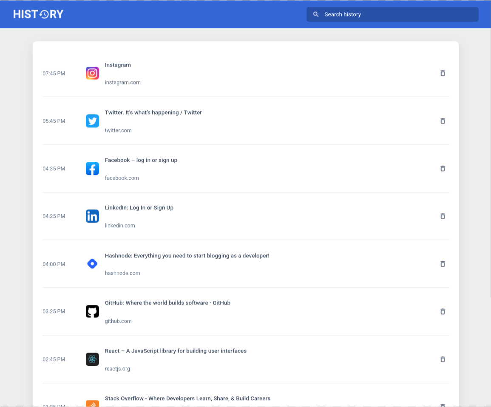
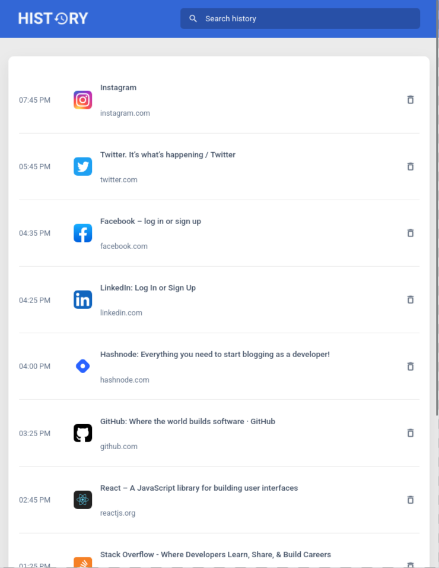

# Browser History App

<p align="center">
  
  
  
  
</p>

<p align="center">
  
  
</p>

A React application that displays a list of browser history items, allows users to search through them, and delete individual entries.

Built as part of **Daily Code 2026**, focusing on list manipulation, controlled inputs, and clean state updates.

---

## 📑 Contents

- [Overview](#-overview)
- [Features](#-features)
- [Concepts Practiced](#-concepts-practiced)
- [Screenshots](#-screenshots)
- [Project Structure](#-project-structure)
- [Getting Started](#-getting-started)
- [Tech Stack](#-tech-stack)
- [Notes](#-notes)
- [Author](#-author)

---

## 📌 Overview

The Browser History App renders a list of visited websites and allows users to filter the history using a search input.  
Each history item can be removed individually, updating the list in real time.

The project emphasizes predictable state management and list-based UI patterns in React.

---

## ✨ Features

- Displays browser history items on initial load
- Search history entries using a case-insensitive input
- Delete individual history items
- Real-time UI updates
- Simple and readable layout

---

## 🧠 Concepts Practiced

- Controlled input elements
- Array filtering and deletion
- List rendering with unique keys
- Parent–child communication using props
- Callback-based state updates

---

## 🖼️ Screenshots





> Add images to the `screenshots/` directory and they will render automatically.

---

## 📁 Project Structure

src/
├── components/
│ ├── BrowserHistory/
│ └── HistoryItem/
├── App.js
└── index.js


---

## 🚀 Getting Started

### Install dependencies
```bash
npm install

Start the development server

npm start

Runs at: http://localhost:3000
🛠️ Tech Stack

    React (Create React App)

    JavaScript (ES6+)

    CSS

📌 Notes

    State updates are handled immutably

    Search and delete operations are derived from state

    Focused on correctness and clean data flow

👤 Author

Built as part of Daily Code 2026
Maintained by Guneshbari

