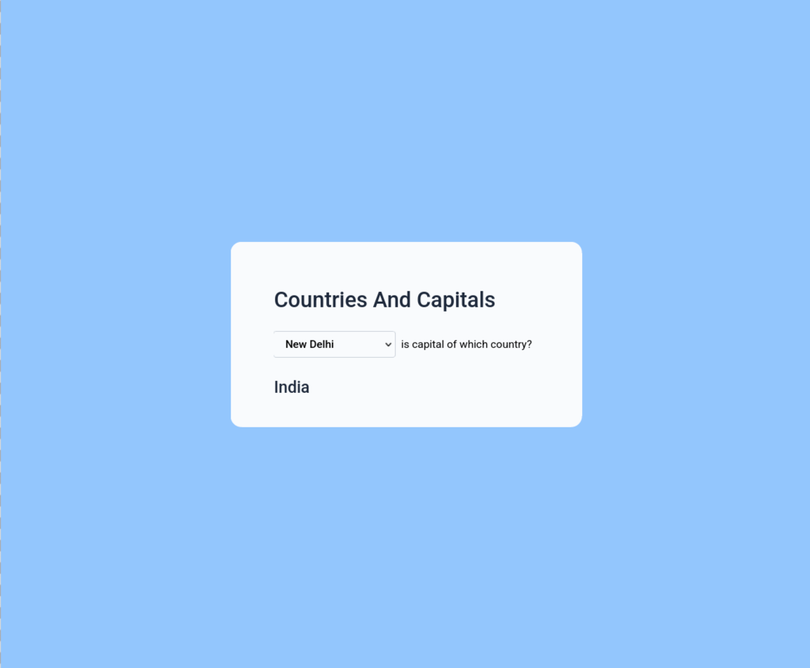
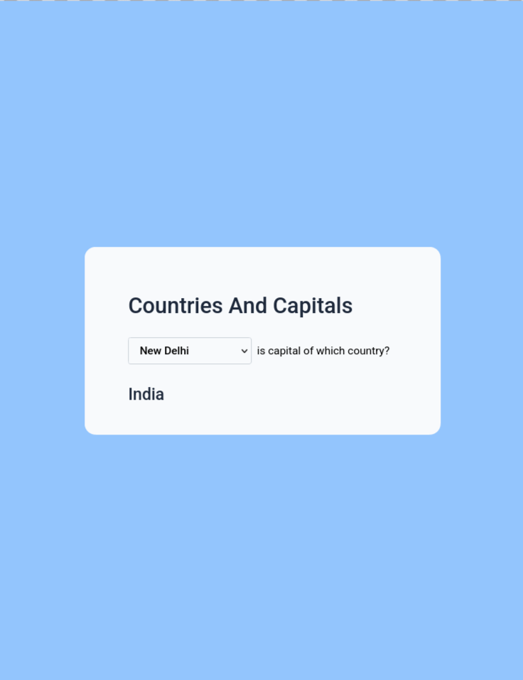
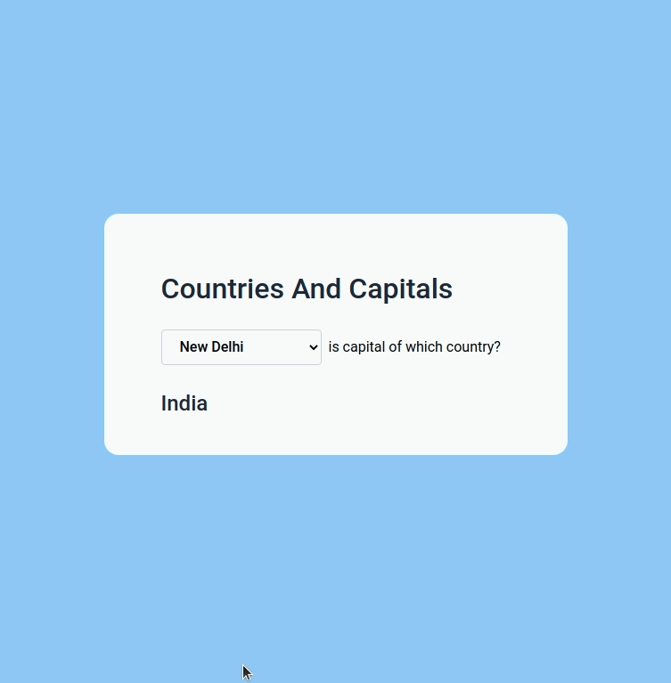

# Capitals App

<p align="center">
  
  
  
  
</p>

<p align="center">
  
  
</p>

A React application that displays countries and dynamically shows their corresponding capitals based on user selection.

Built as part of **Daily Code 2026**, focusing on controlled components, state updates, and clean conditional rendering.

---

## 📑 Contents

- [Overview](#-overview)
- [Features](#-features)
- [Concepts Practiced](#-concepts-practiced)
- [Screenshots](#-screenshots)
- [Project Structure](#-project-structure)
- [Getting Started](#-getting-started)
- [Tech Stack](#-tech-stack)
- [Notes](#-notes)
- [Author](#-author)

---

## 📌 Overview

The Capitals App allows users to select a country from a dropdown menu and instantly displays the corresponding capital city.

This project reinforces how React handles controlled form elements and state-driven UI updates.

---

## ✨ Features

- Displays a list of countries in a dropdown
- Shows the corresponding capital on selection
- Controlled `<select>` element
- Instant UI updates based on state
- Simple and focused interface

---

## 🧠 Concepts Practiced

- Controlled form elements
- State management
- Event handling
- Conditional rendering
- Props and component structure

---

## 🖼️ Screenshots





---

## 📁 Project Structure

src/
├── components/
│ └── Capitals/
├── App.js
└── index.js

---

## 🚀 Getting Started

### Install dependencies
```bash
npm install

Start the development server

npm start

Runs at: http://localhost:3000
🛠️ Tech Stack

    React (Create React App)

    JavaScript (ES6+)

    CSS

    Testing Library

📌 Notes

    Designed to satisfy strict testing requirements

    Focused on correctness and clarity

    Emphasizes predictable state-driven UI behavior

👤 Author

Built as part of Daily Code 2026
Maintained by Guneshbari
