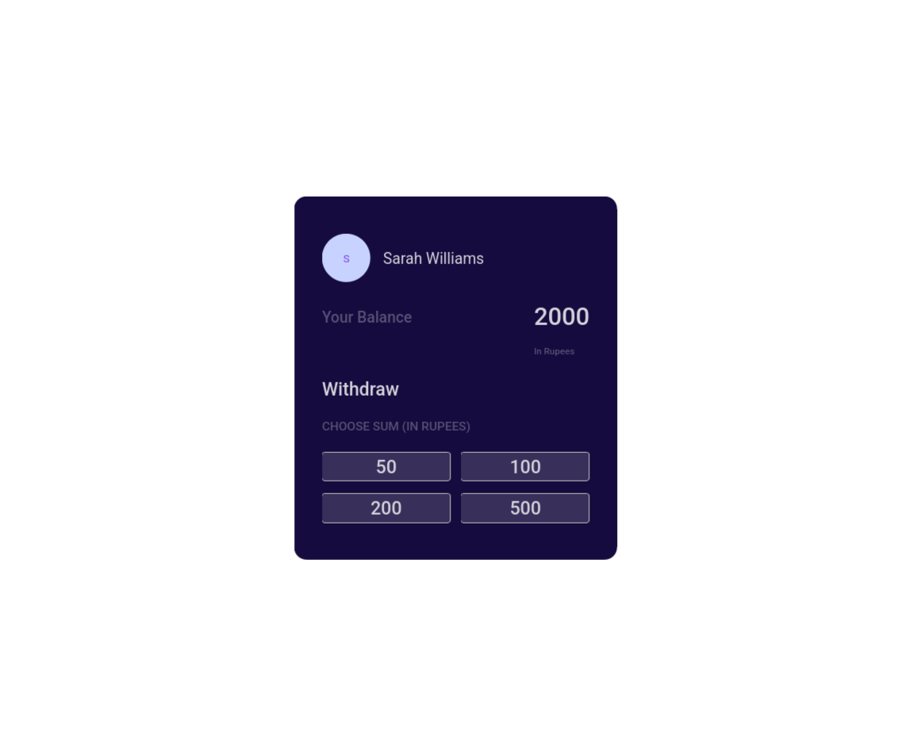
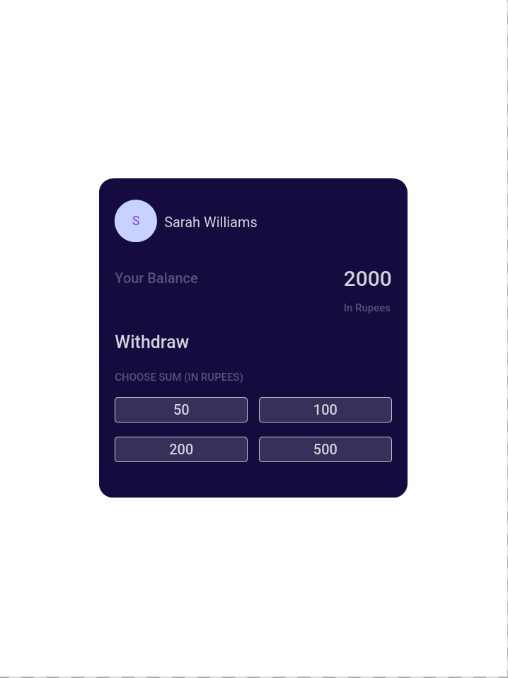

# Cash Withdrawal App

<p align="center">
  
  
  
  
</p>

<p align="center">
  
  
</p>

A React application simulating a basic ATM withdrawal interface.

---

## 📑 Contents

- [Overview](#-overview)
- [Features](#-features)
- [Concepts Practiced](#-concepts-practiced)
- [Screenshots](#-screenshots)
- [Project Structure](#-project-structure)
- [Getting Started](#-getting-started)
- [Tech Stack](#-tech-stack)
- [Notes](#-notes)
- [Author](#-author)

---

## 📌 Overview

The Cash Withdrawal App displays a fixed balance and allows users to deduct money using predefined denominations.

---

## ✨ Features

- Initial balance of 2000
- Predefined withdrawal buttons
- Real-time balance updates

---

## 🧠 Concepts Practiced

- Parent–child communication
- Callback functions
- Immutable state updates

---

## 🖼️ Screenshots





---

## 📁 Project Structure

src/
├── components/
│ ├── CashWithdrawal/
│ └── DenominationItem/
├── App.js
└── index.js


---

## 🚀 Getting Started

```bash
npm install
npm start

🛠️ Tech Stack

    React

    JavaScript (ES6+)

    CSS

📌 Notes

    State is owned by the parent

    Children communicate intent only

👤 Author

Built as part of Daily Code 2026
Maintained by Guneshbari
