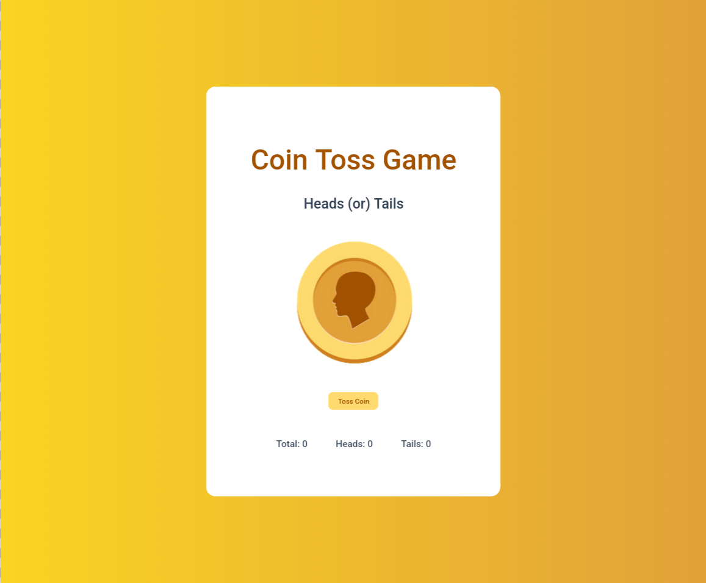
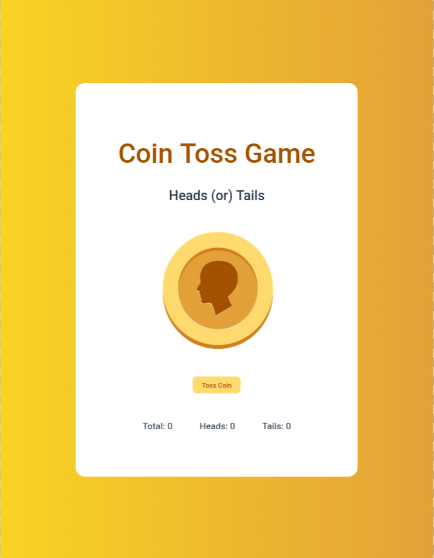

# Coin Toss App

  
  
  
  

  
  

A simple React game that simulates a coin toss and keeps track of heads, tails, and total tosses.

Built as part of **Daily Code 2026**, focusing on randomness, conditional rendering, and clean state updates.

---

## 📑 Contents

- Overview  
- Features  
- Game Logic  
- Concepts Practiced  
- Screenshots  
- Project Structure  
- Getting Started  
- Tech Stack  
- Notes  
- Author  

---

## 📌 Overview

The Coin Toss Game generates a random result every time the **Toss Coin** button is clicked.  
Based on the result, the app updates the displayed coin image and increments the corresponding counters.

This project reinforces how React handles state changes driven by random events.

---

## ✨ Features

- Toss a virtual coin with a button click  
- Displays heads or tails image dynamically  
- Tracks:
  - Total tosses
  - Heads count
  - Tails count  
- Instant UI updates after each toss  

---

## 🎯 Game Logic

Toss result is generated using:

Math.floor(Math.random() * 2)

Result mapping:
- 0 → Heads  
- 1 → Tails  

On each toss:
- Total count is incremented
- Heads or tails count is incremented accordingly
- Coin image updates dynamically

The toss result image must have:

alt="toss result"

---

## 🧠 Concepts Practiced

- React state management  
- Conditional rendering  
- Random number generation  
- Event handling  
- Derived UI from state  

---

## 🖼️ Screenshots

  
  

---

## 📁 Project Structure

src/
├── components/
│   └── CoinToss/
│       ├── index.js
│       └── index.css
├── App.js
└── index.js

---

## 🚀 Getting Started

Install dependencies:

npm install

Start the development server:

npm start

Runs at: http://localhost:3000

---

## 🛠️ Tech Stack

- React (Create React App)  
- JavaScript (ES6+)  
- CSS  
- Testing Library  

---

## 📌 Notes

- Initial heads, tails, and total counts start at 0  
- Image alt attribute is mandatory for tests  
- Designed to satisfy strict testing requirements  
- Focused on logic clarity over UI complexity  

---

## 👤 Author

Built as part of **Daily Code 2026**  
Maintained by **Guneshbari**
