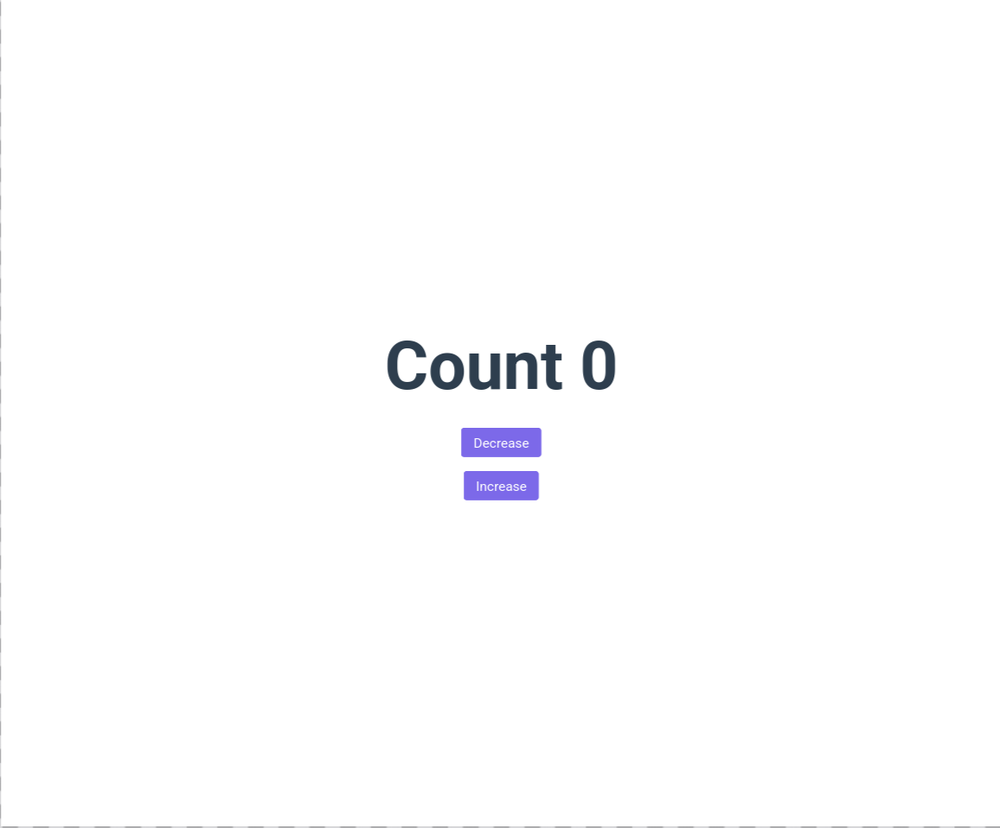
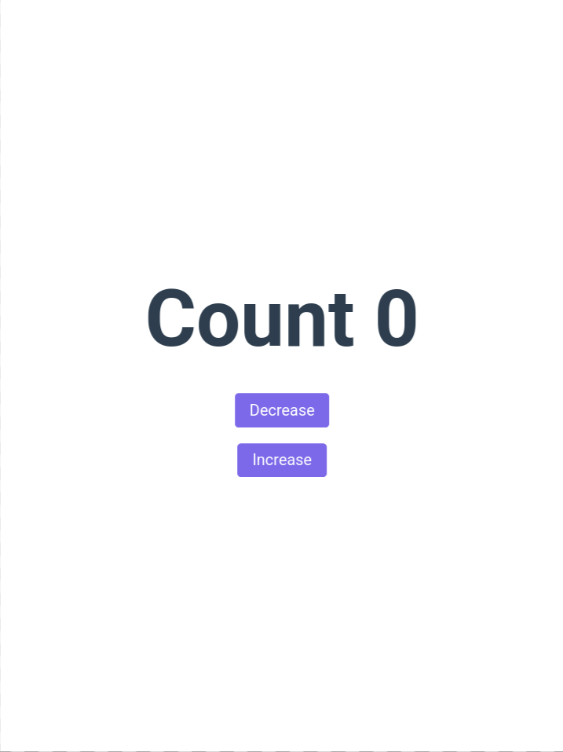
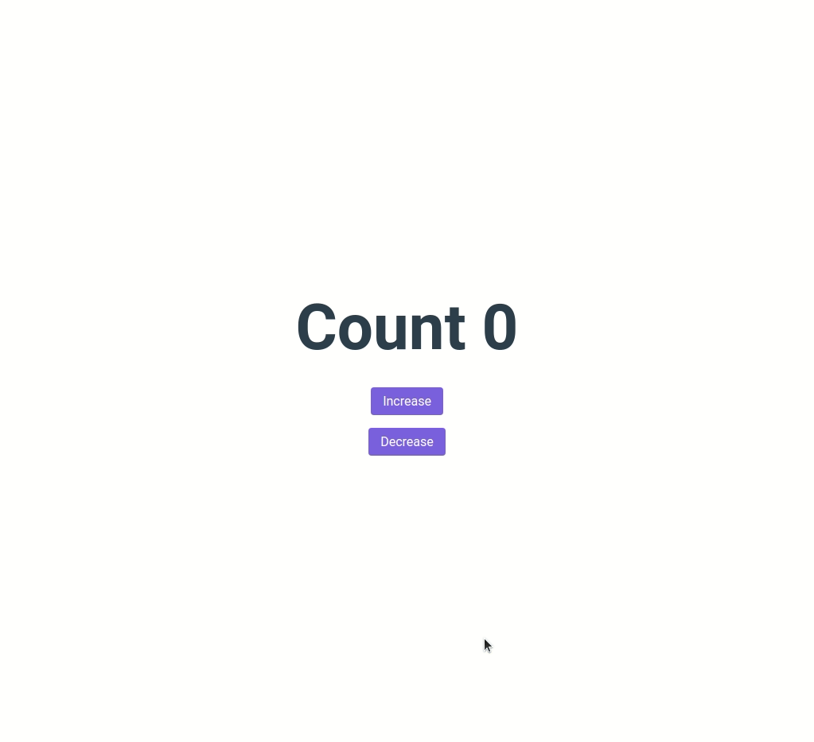

# Counter App

<p align="center">
  
  
  
  
</p>

<p align="center">
  
  
</p>

A simple React application that maintains and updates a numeric counter based on user interactions.

Built as part of **Daily Code 2026**, focusing on state updates, event handling, and clean component structure.

---

## 📑 Contents

- [Overview](#-overview)
- [Features](#-features)
- [Concepts Practiced](#-concepts-practiced)
- [Screenshots](#-screenshots)
- [Project Structure](#-project-structure)
- [Getting Started](#-getting-started)
- [Tech Stack](#-tech-stack)
- [Notes](#-notes)
- [Author](#-author)

---

## 📌 Overview

The Counter App displays a numeric value that can be incremented or modified through user interaction.

This project is intentionally minimal and designed to reinforce fundamental React concepts such as state management and event-driven UI updates.

---

## ✨ Features

- Displays a numeric counter
- Updates count based on user actions
- Instant UI updates on state change
- Simple and focused user interface

---

## 🧠 Concepts Practiced

- React state management
- Event handling
- Component rendering
- Unidirectional data flow

---

## 🖼️ Screenshots





---

## 📁 Project Structure

src/
├── components/
│ └── Counter/
├── App.js
└── index.js


---

## 🚀 Getting Started

### Install dependencies
```bash
npm install

Start the development server

npm start

Runs at: http://localhost:3000
🛠️ Tech Stack

    React (Create React App)

    JavaScript (ES6+)

    CSS

    Testing Library

📌 Notes

    Designed to reinforce core React fundamentals

    Focused on clarity and correctness

    Suitable as a learning reference for state-driven UI logic

👤 Author

Built as part of Daily Code 2026
Maintained by Guneshbari
