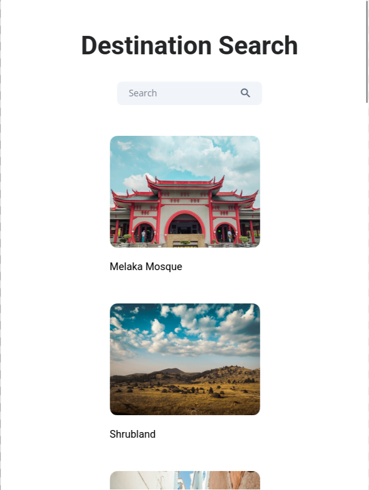

# Destination Search App

<p align="center">
  
  
  
  
</p>

<p align="center">
  
  
</p>

A React application that allows users to search and filter destinations dynamically based on input text.

Built as part of **Daily Code 2026**, focusing on list filtering, controlled inputs, and clean component composition.

---

## 📑 Contents

- [Overview](#-overview)
- [Features](#-features)
- [Concepts Practiced](#-concepts-practiced)
- [Screenshots](#-screenshots)
- [Project Structure](#-project-structure)
- [Getting Started](#-getting-started)
- [Tech Stack](#-tech-stack)
- [Notes](#-notes)
- [Author](#-author)

---

## 📌 Overview

The Destination Search App displays a list of destinations and allows users to filter them in real time using a search input.

The filtering is case-insensitive and updates instantly as the user types, reinforcing predictable state-driven UI behavior in React.

---

## ✨ Features

- Displays all destinations on initial load
- Real-time search filtering
- Case-insensitive matching
- Clean, responsive layout
- Simple and focused UI

---

## 🧠 Concepts Practiced

- Controlled input elements
- Array filtering with `filter`
- List rendering with `map`
- Parent–child component structure
- Props-based data flow

---

## 🖼️ Screenshots





> Add images to the `screenshots/` directory and they will render automatically.

---

## 📁 Project Structure

src/
├── components/
│ ├── DestinationSearch/
│ └── DestinationItem/
├── App.js
└── index.js


---

## 🚀 Getting Started

### Install dependencies
```bash
npm install

Start the development server

npm start

Runs at: http://localhost:3000
🛠️ Tech Stack

    React (Create React App)

    JavaScript (ES6+)

    CSS

    Testing Library (for component testing)

📌 Notes

    Folder names and structure must match test expectations

    Emphasis on clarity and correctness over visual complexity

    Designed to reinforce search-based UI patterns

👤 Author

Built as part of Daily Code 2026
Maintained by Guneshbari
