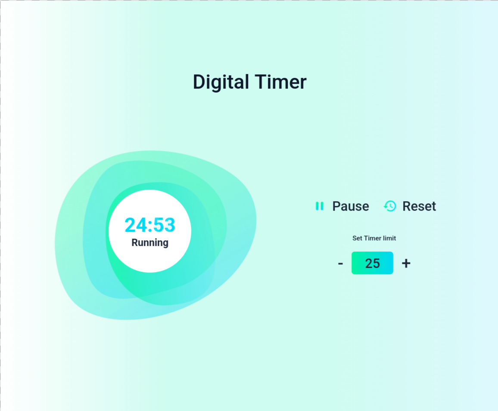
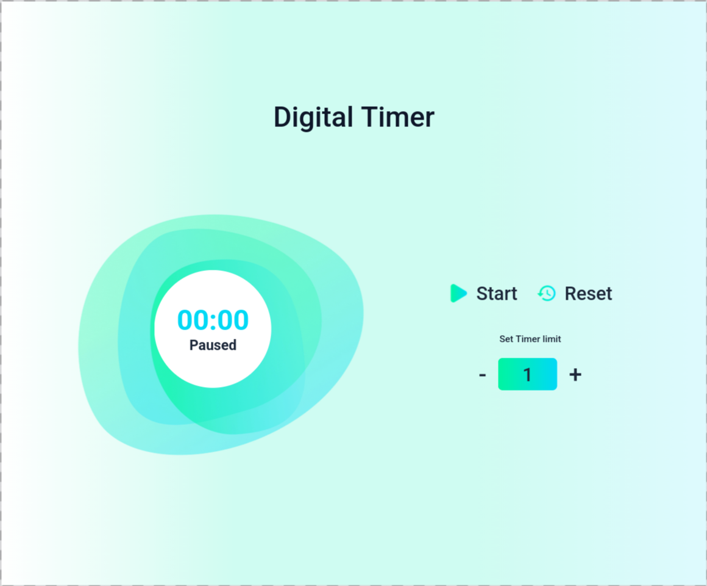

# Digital Timer App

  
  
  
  

  
  

A React application that implements a fully functional digital countdown timer with start, pause, reset, and configurable time limits.

Built as part of **Daily Code 2026**, focusing on timers, interval management, and complex state transitions.

---

## 📑 Contents

- Overview  
- Features  
- Timer Logic  
- Concepts Practiced  
- Screenshots  
- Project Structure  
- Getting Started  
- Tech Stack  
- Notes  
- Author  

---

## 📌 Overview

The Digital Timer App allows users to start a countdown timer, pause and resume it, adjust the timer limit, and reset the timer to its initial state.

This project reinforces how to manage time-based logic, intervals, and UI state synchronization in React.

---

## ✨ Features

- Default timer limit set to 25 minutes  
- Start and pause timer functionality  
- Resume timer from paused state  
- Increase or decrease timer limit using plus and minus buttons  
- Disable controls appropriately during timer execution  
- Reset timer to initial state  
- Automatic handling when timer reaches `00:00`  

---

## ⏱️ Timer Logic

- Initial timer limit: 25 minutes  
- When **Start** is clicked:
  - Timer starts counting down
  - Status changes to `Running`
  - Play icon switches to pause icon
  - Plus and minus buttons are disabled

- When **Pause** is clicked:
  - Timer stops
  - Status changes to `Paused`
  - Pause icon switches to play icon

- When **Plus / Minus** is clicked:
  - Timer limit increases or decreases by 1 minute
  - Timer display updates accordingly

- When timer reaches `00:00`:
  - Timer stops automatically
  - Status changes to `Paused`
  - Start button resets for replay

- When **Reset** is clicked:
  - Timer stops
  - Timer limit resets to initial value
  - Controls are re-enabled

---

## 🧠 Concepts Practiced

- React state management  
- Interval handling with `setInterval` and `clearInterval`  
- Conditional rendering  
- Event handling  
- Time calculations and formatting  
- UI state synchronization  

---

## 🖼️ Screenshots

  
  
  

---

## 📁 Project Structure

src/
├── components/
│   └── DigitalTimer/
│       ├── index.js
│       └── index.css
├── App.js
└── index.js

---

## 🚀 Getting Started

Install dependencies:

npm install

Start the development server:

npm start

Runs at: http://localhost:3000

---

## 🛠️ Tech Stack

- React (Create React App)  
- JavaScript (ES6+)  
- CSS  
- Testing Library  

---

## 📌 Notes

- Play icon must have `alt="play icon"`  
- Pause icon must have `alt="pause icon"`  
- Reset icon must have `alt="reset icon"`  
- Timer must correctly handle pause, resume, and reset states  
- Designed to satisfy strict testing requirements  

---

## 👤 Author

Built as part of **Daily Code 2026**  
Maintained by **Guneshbari**

