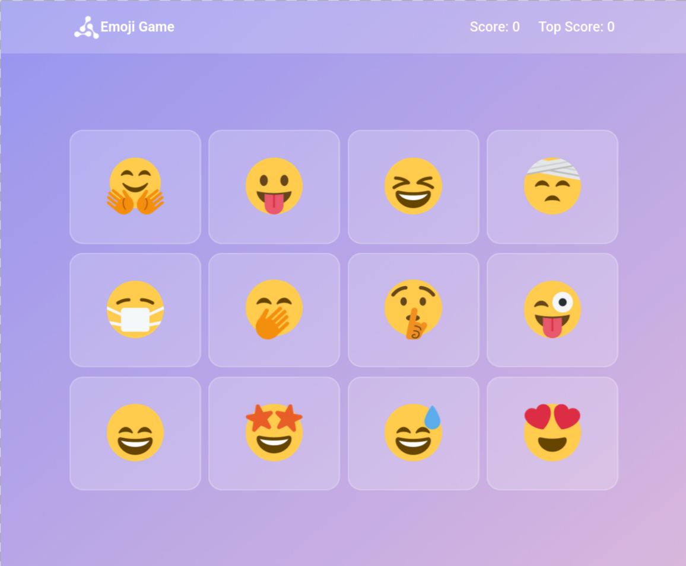
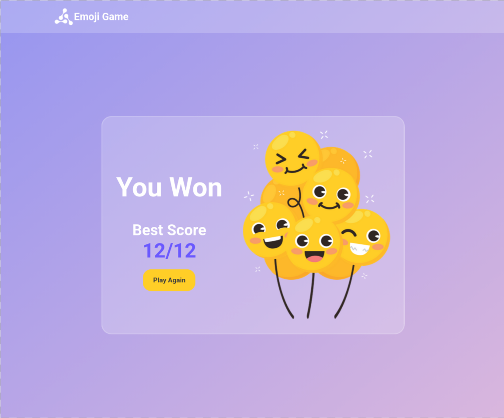
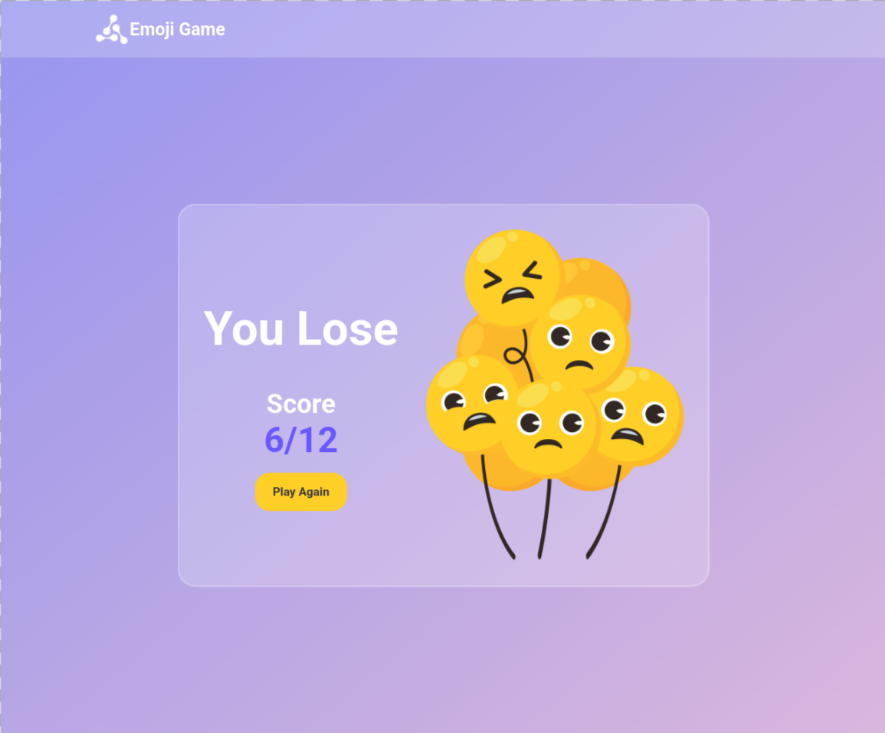

# Emoji Game

  
  
  
  

  
  

A React-based memory game where users must click each emoji only once to win. Clicking the same emoji twice ends the game.

Built as part of **Daily Code 2026**, focusing on game logic, state tracking, and conditional rendering.

---

## 📑 Contents

- Overview  
- Features  
- Game Logic  
- Concepts Practiced  
- Screenshots  
- Project Structure  
- Getting Started  
- Tech Stack  
- Notes  
- Author  

---

## 📌 Overview

The Emoji Game challenges users to click each emoji exactly once.  
If the user clicks an emoji that has already been clicked, the game ends.

The game tracks the current score and maintains the top score across multiple games.

---

## ✨ Features

- Displays a grid of emojis  
- Tracks current score and top score  
- Detects duplicate emoji clicks  
- Displays win or lose screens based on gameplay  
- Allows replay without resetting top score  

---

## 🎯 Game Logic

- Initial values:
  - Score = 0  
  - Top Score = 0  

- When an emoji is clicked:
  - If it has **not** been clicked before:
    - Score increments by one
  - If it **has** been clicked before:
    - Lose Game view is displayed

- If all emojis are clicked exactly once:
  - Won Game view is displayed

- Top Score updates if current score exceeds previous top score

- Clicking **Play Again**:
  - Resets current score
  - Preserves top score

---

## 🧠 Concepts Practiced

- React state management  
- Conditional rendering  
- Array state tracking  
- Event handling  
- Parent–child communication via props  
- Game logic implementation  

---

## 🖼️ Screenshots

  
  
  

---

## 📁 Project Structure

src/
├── components/
│   ├── EmojiGame/
│   │   ├── index.js
│   │   └── index.css
│   ├── NavBar/
│   │   ├── index.js
│   │   └── index.css
│   ├── EmojiCard/
│   │   ├── index.js
│   │   └── index.css
│   └── WinOrLoseCard/
│       ├── index.js
│       └── index.css
├── App.js
└── index.js

---

## 🚀 Getting Started

Install dependencies:

npm install

Start the development server:

npm start

Runs at: http://localhost:3000

---

## 🛠️ Tech Stack

- React (Create React App)  
- JavaScript (ES6+)  
- CSS  
- Testing Library  

---

## 📌 Notes

- Emoji images must have `alt` equal to `emojiName`  
- Score resets on replay, top score persists  
- Designed to satisfy strict testing requirements  
- Focused on correctness of game logic  

---

## 👤 Author

Built as part of **Daily Code 2026**  
Maintained by **Guneshbari**

