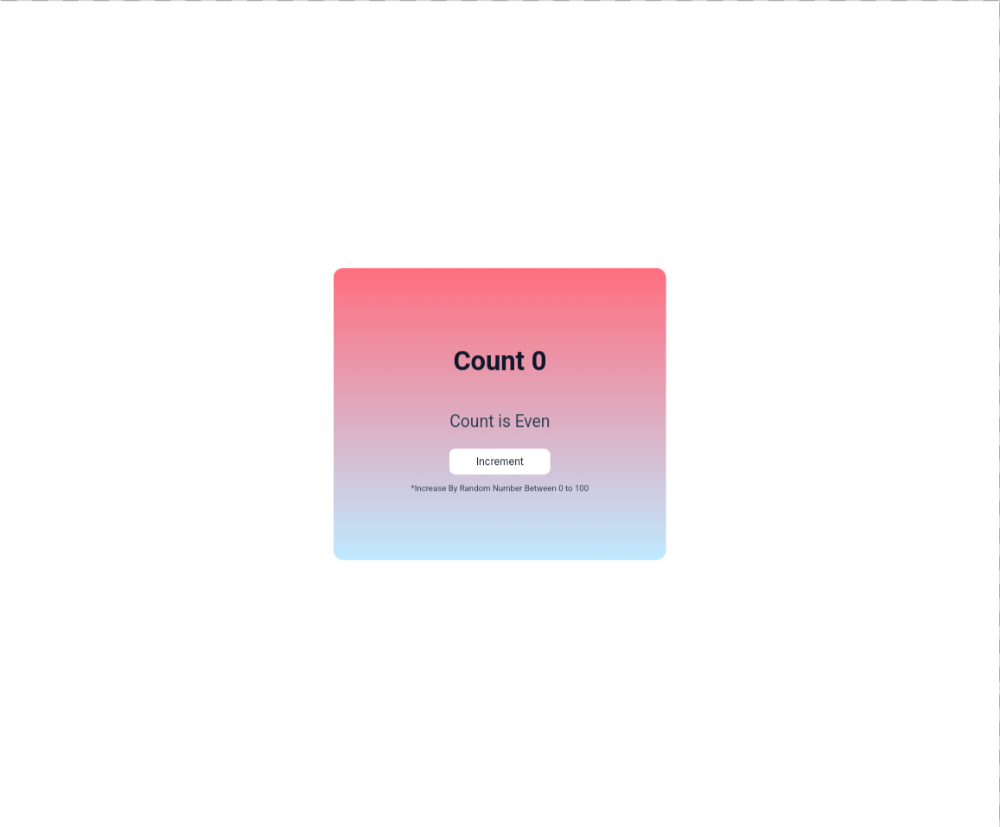
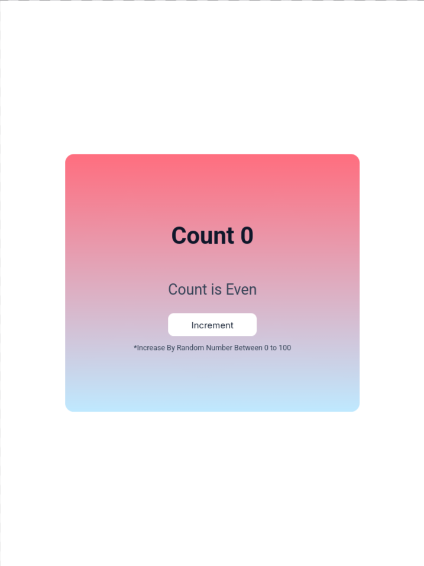
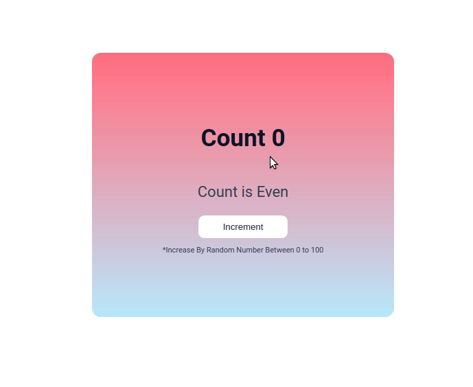

# Even Odd App

<p align="center">
  
  
  
  
</p>

<p align="center">
  
  
</p>

A React application that increments a counter by a random value and displays whether the resulting count is even or odd.

This project is part of **Daily Code 2026** and focuses on state-driven UI updates and conditional rendering.

---

## 📑 Contents

- [Overview](#-overview)
- [Features](#-features)
- [Concepts Practiced](#-concepts-practiced)
- [Screenshots](#-screenshots)
- [Project Structure](#-project-structure)
- [Getting Started](#-getting-started)
- [Tech Stack](#-tech-stack)
- [Notes](#-notes)
- [Author](#-author)

---

## 📌 Overview

The Even Odd App maintains a numeric count that increases by a random number on each click and determines whether the current count is even or odd.

The goal is to practice clean state management and derived UI logic in React.

---

## ✨ Features

- Random increment between 0 and 100
- Real-time even/odd status display
- Simple and readable UI

---

## 🧠 Concepts Practiced

- React state management
- Derived state calculation
- Event handling
- Conditional rendering

---

## 🖼️ Screenshots



---

## 📁 Project Structure

src/
├── components/
│ └── EvenOddApp/
├── App.js
└── index.js


---

## 🚀 Getting Started

```bash
npm install
npm start

Runs at http://localhost:3000
🛠️ Tech Stack

    React (Create React App)

    JavaScript (ES6+)

    CSS

📌 Notes

    Focuses on correctness over visual polish

    No derived state stored unnecessarily

👤 Author

Built as part of Daily Code 2026
Maintained by Guneshbari
