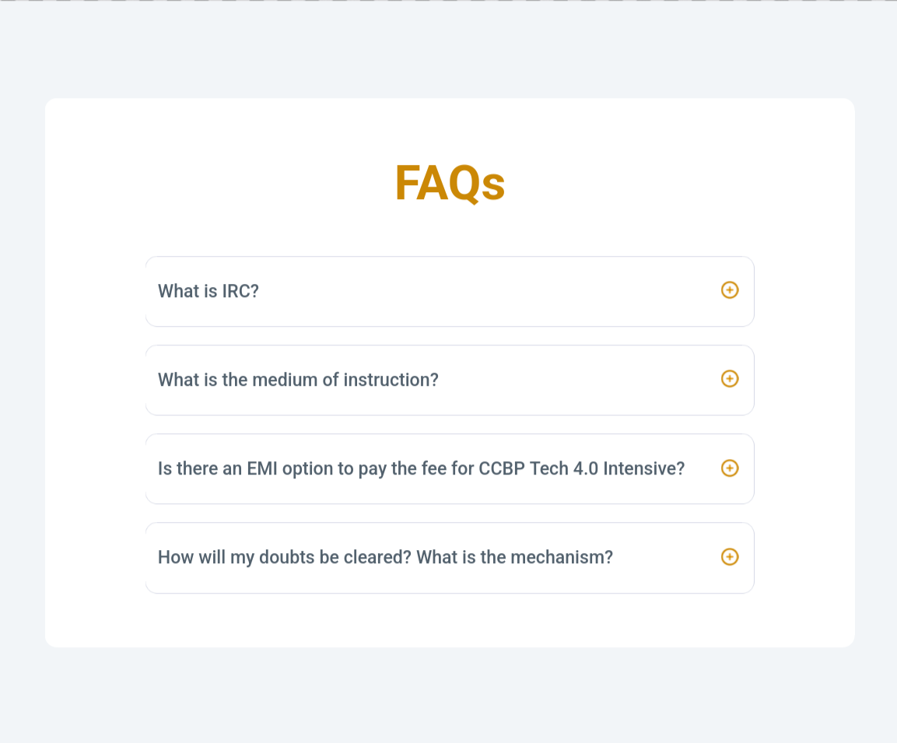
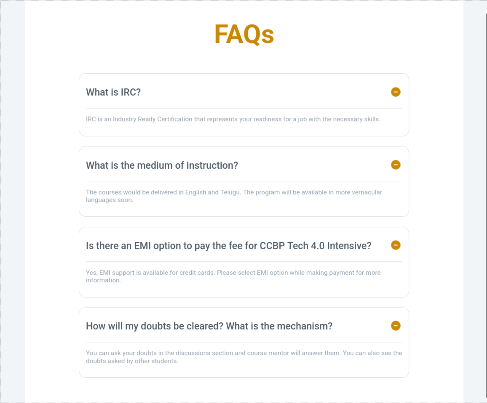
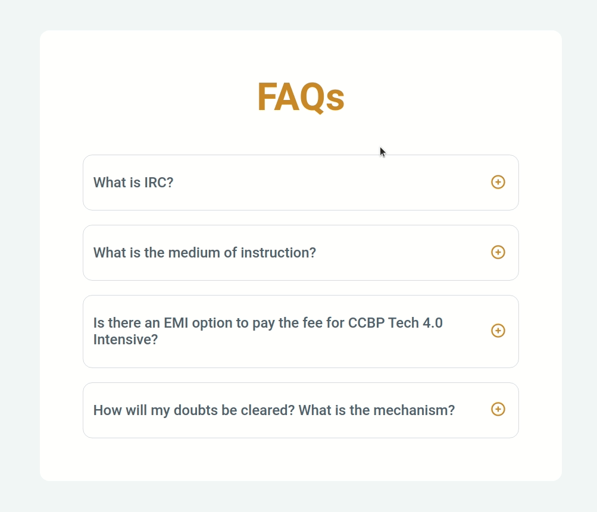

# FAQs App

  
  
  
  

  
  

A React application that displays a list of frequently asked questions with expandable and collapsible answers.

Built as part of **Daily Code 2026**, focusing on toggle-based UI, conditional rendering, and parent–child state flow.

---

## 📑 Contents

- Overview
- Features
- FAQ Toggle Logic
- Concepts Practiced
- Screenshots
- Project Structure
- Getting Started
- Tech Stack
- Notes
- Author

---

## 📌 Overview

The FAQs App allows users to expand and collapse answers for a list of frequently asked questions using plus and minus icons.

This project reinforces conditional rendering and component-level state management in React.

---

## ✨ Features

- Displays a list of FAQs
- Expand answer using plus icon
- Collapse answer using minus icon
- Toggle icons based on state
- Clean and accessible UI

---

## 🔁 FAQ Toggle Logic

- When the **plus icon** is clicked:
  - The answer becomes visible
  - The plus icon changes to a minus icon
- When the **minus icon** is clicked:
  - The answer is hidden
  - The minus icon changes back to a plus icon

Each FAQ manages its own visibility state through props and callbacks.

---

## 🧠 Concepts Practiced

- Conditional rendering
- State management
- Parent–child component communication
- Event handling
- Reusable components

---

## 🖼️ Screenshots

---

## 📁 Project Structure

src/
├── components/
│   ├── Faqs/
│   │   ├── index.js
│   │   └── index.css
│   └── FaqItem/
│       ├── index.js
│       └── index.css
├── App.js
└── index.js

---

## 🚀 Getting Started

Install dependencies:

    npm install

Start the development server:

    npm start

Runs at: http://localhost:3000

---

## 🛠️ Tech Stack

- React (Create React App)
- JavaScript (ES6+)
- CSS

---

## 📌 Notes

- Icons toggle based on FAQ open state
- Each FAQ item maintains independent visibility
- Designed to satisfy strict testing requirements

---

## 👤 Author

Built as part of **Daily Code 2026**
Maintained by **Guneshbari**

