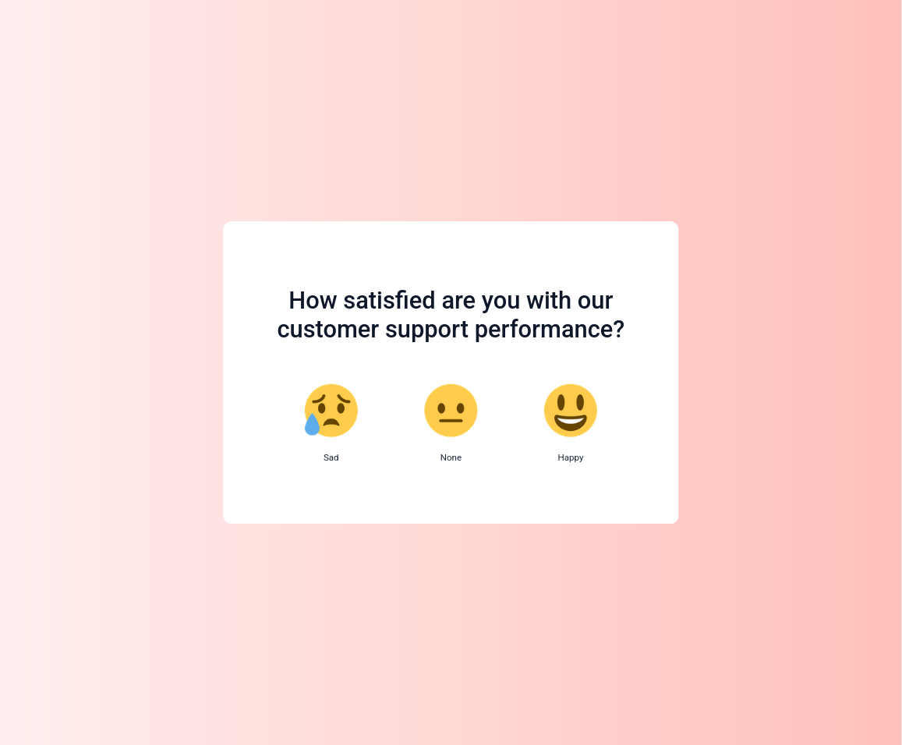
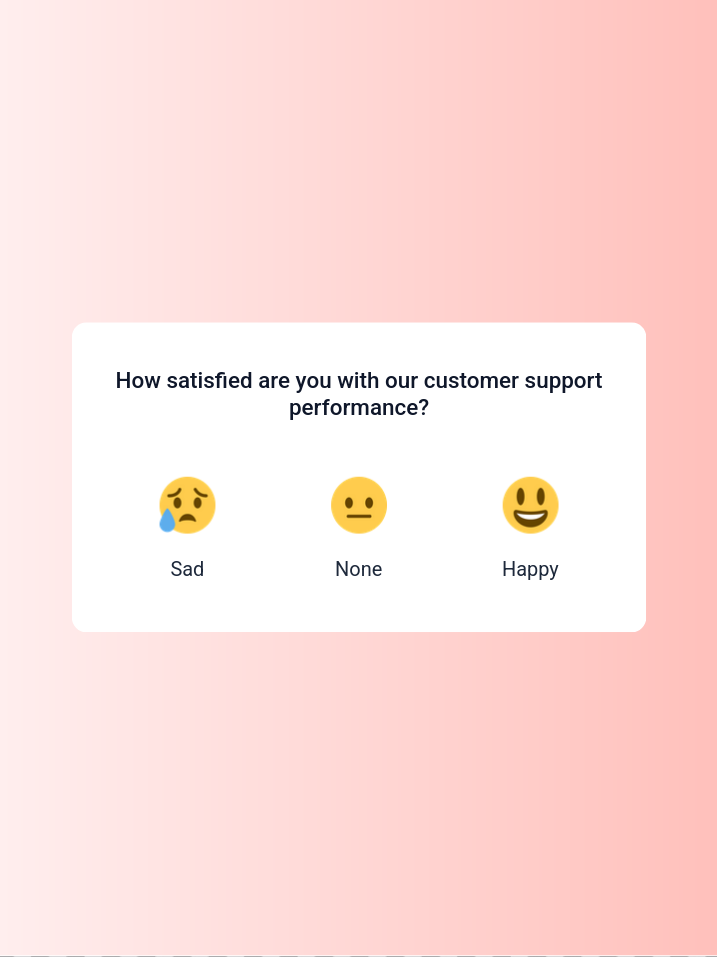
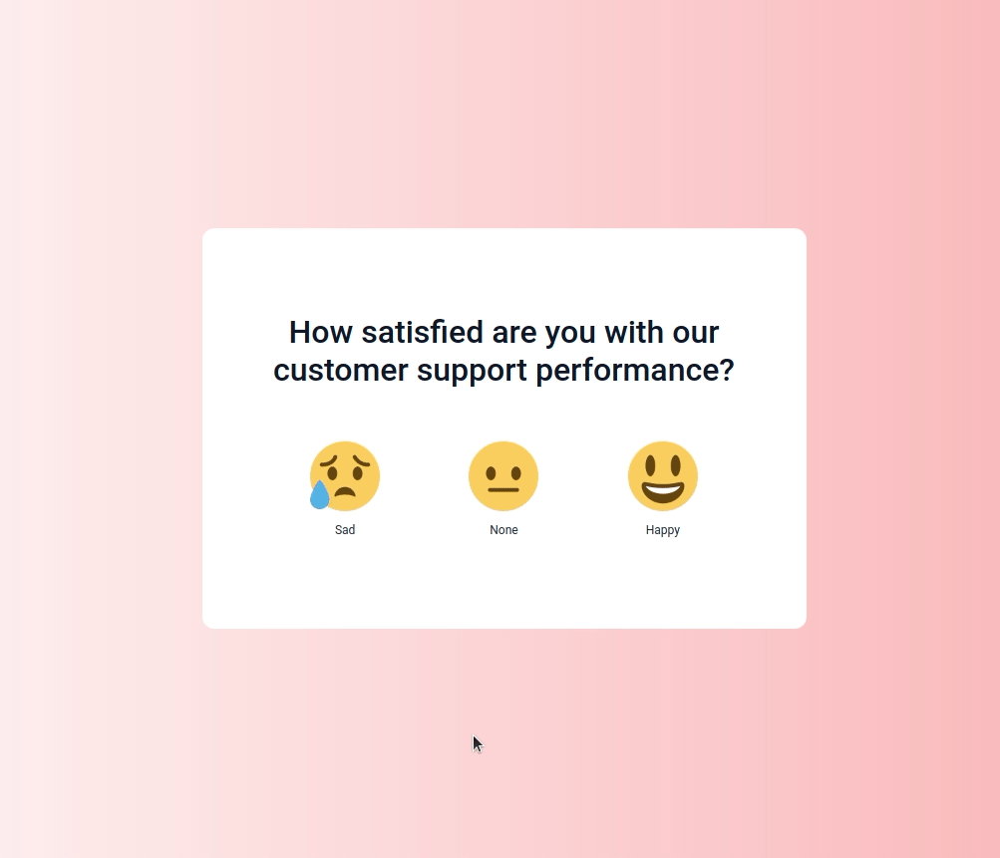

# Feedback App

<p align="center">
  
  
  
  
</p>

<p align="center">
  
  
</p>

A React application that allows users to submit feedback and displays a response based on user interaction.

Built as part of **Daily Code 2026**, focusing on event handling, conditional rendering, and clean state management.

---

## 📑 Contents

- [Overview](#-overview)
- [Features](#-features)
- [Concepts Practiced](#-concepts-practiced)
- [Screenshots](#-screenshots)
- [Project Structure](#-project-structure)
- [Getting Started](#-getting-started)
- [Tech Stack](#-tech-stack)
- [Notes](#-notes)
- [Author](#-author)

---

## 📌 Overview

The Feedback App presents users with feedback options and displays a confirmation or response once feedback is submitted.

The project is intentionally small and focused, designed to reinforce core React interaction patterns and predictable UI updates.

---

## ✨ Features

- Displays multiple feedback options
- Handles user interaction through button clicks
- Conditionally renders UI based on feedback submission
- Simple and user-friendly interface

---

## 🧠 Concepts Practiced

- React state management
- Event handling
- Conditional rendering
- Component-based architecture
- Unidirectional data flow

---

## 🖼️ Screenshots





> Add images to the `screenshots/` directory and they will render automatically on GitHub.

---

## 📁 Project Structure

src/
├── components/
│ └── Feedback/
├── App.js
└── index.js


---

## 🚀 Getting Started

### Install dependencies
```bash
npm install

Start the development server

npm start

Runs at: http://localhost:3000
🛠️ Tech Stack

    React (Create React App)

    JavaScript (ES6+)

    CSS

    Testing Library

📌 Notes

    Focused on clarity and correctness

    Designed to meet strict testing requirements

    Emphasizes clean UI logic over visual complexity

👤 Author

Built as part of Daily Code 2026
Maintained by Guneshbari
