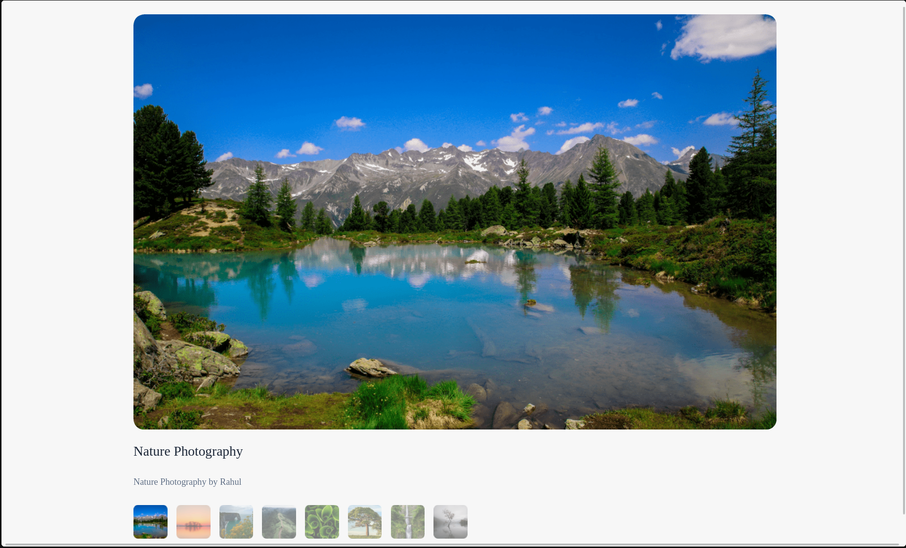
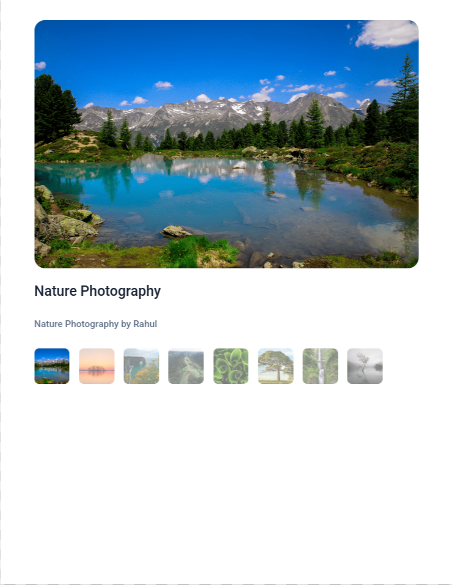

# Gallery App

  
  
  
  

  
  

A React application that displays a gallery of images and allows users to interact with them through state-driven UI updates.

Built as part of **Daily Code 2026**, focusing on component composition, list rendering, and predictable state management.

---

## 📑 Contents

- [Overview](#-overview)
- [Features](#-features)
- [Concepts Practiced](#-concepts-practiced)
- [Screenshots](#-screenshots)
- [Project Structure](#-project-structure)
- [Getting Started](#-getting-started)
- [Tech Stack](#-tech-stack)
- [Notes](#-notes)
- [Author](#-author)

---

## 📌 Overview

The Gallery App renders a collection of images in a structured layout.  
Users can interact with the gallery, and the UI updates dynamically based on application state.

The project reinforces how React handles lists, keys, and component-driven layouts.

---

## ✨ Features

- Displays a gallery of images
- Renders images dynamically using lists
- Highlights selected or active items (if applicable)
- Clean and responsive layout

---

## 🧠 Concepts Practiced

- List rendering with `map`
- Use of unique `key` props
- State-driven UI updates
- Component-based architecture
- Conditional rendering

---

## 🖼️ Screenshots

---

## 📁 Project Structure

src/
├── components/
│   ├── Gallery/
│   └── ThumbnailItem/
├── App.js
└── index.js

---

🛠️ Tech Stack

React (Create React App)

JavaScript (ES6+)

CSS

Testing Library

📌 Notes

Designed to meet strict testing requirements

Focused on correct list semantics and state flow

Emphasizes clarity over visual complexity

👤 Author

Built as part of Daily Code 2026
Maintained by Guneshbari
