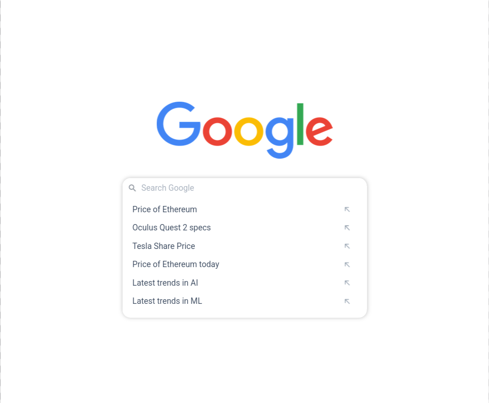
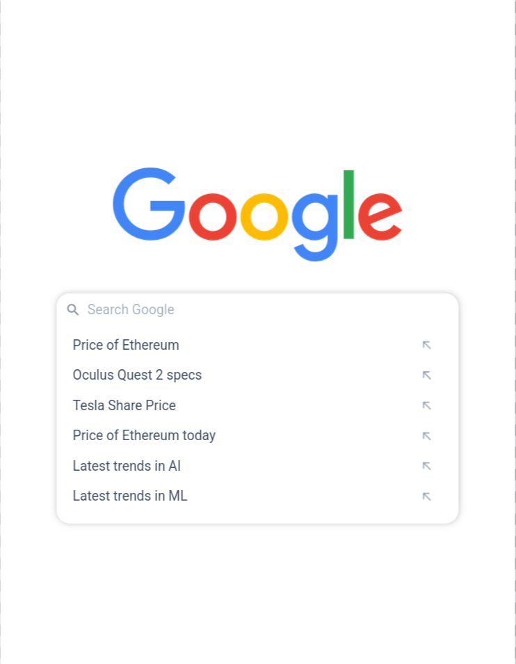

# Google Search Suggestions App

<p align="center">
  
  
  
  
</p>

<p align="center">
  
  
</p>

A Google-style search suggestions interface built with React.

---

## 📑 Contents

- [Overview](#-overview)
- [Features](#-features)
- [Concepts Practiced](#-concepts-practiced)
- [Screenshots](#-screenshots)
- [Project Structure](#-project-structure)
- [Getting Started](#-getting-started)
- [Tech Stack](#-tech-stack)
- [Notes](#-notes)
- [Author](#-author)

---

## 📌 Overview

As the user types, matching suggestions are filtered and displayed in real time. Selecting a suggestion fills the search input.

---

## ✨ Features

- Case-insensitive search
- Real-time filtering
- Click-to-fill suggestions

---

## 🧠 Concepts Practiced

- Controlled inputs
- List filtering
- Callback-based updates

---

## 🖼️ Screenshots





---

## 📁 Project Structure

src/
├── components/
│ ├── GoogleSuggestions/
│ └── SuggestionItem/
├── App.js
└── index.js


---

## 🚀 Getting Started

```bash
npm install
npm start

🛠️ Tech Stack

    React

    JavaScript (ES6+)

    CSS

📌 Notes

    Designed to satisfy strict test conditions

    Predictable data flow

👤 Author

Built as part of Daily Code 2026
Maintained by Guneshbari
