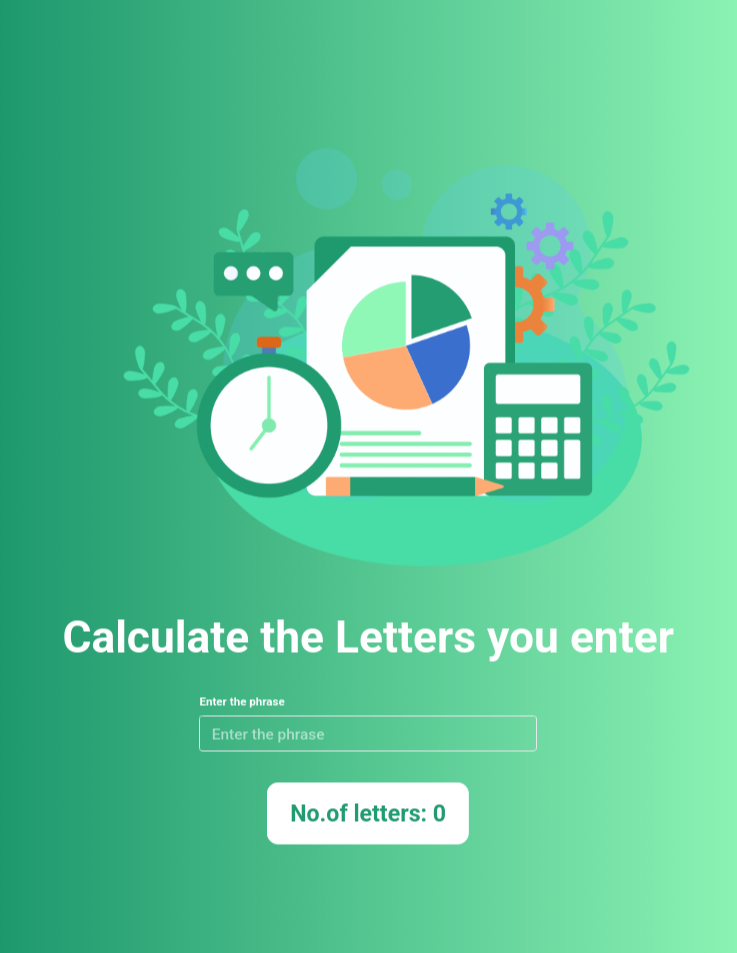

# Letters Calculator App

<p align="center">
  
  
  
  
</p>

<p align="center">
  
  
</p>

A React application that counts the number of letters entered by the user in real time.

---

## 📑 Contents

- [Overview](#-overview)
- [Features](#-features)
- [Concepts Practiced](#-concepts-practiced)
- [Screenshots](#-screenshots)
- [Project Structure](#-project-structure)
- [Getting Started](#-getting-started)
- [Tech Stack](#-tech-stack)
- [Notes](#-notes)
- [Author](#-author)

---

## 📌 Overview

Tracks user input and dynamically displays the total number of letters typed, starting from zero.

---

## ✨ Features

- Real-time letter count
- Controlled input field
- Accessible form elements

---

## 🧠 Concepts Practiced

- Controlled forms
- State updates on input change
- Accessibility basics

---

## 🖼️ Screenshots





---

## 📁 Project Structure

src/
├── components/
│ └── LettersCalculator/
├── App.js
└── index.js


---

## 🚀 Getting Started

```bash
npm install
npm start

🛠️ Tech Stack

    React

    JavaScript (ES6+)

    CSS

📌 Notes

    Designed to satisfy testing requirements

    Emphasis on clarity over features

👤 Author

Built as part of Daily Code 2026
Maintained by Guneshbari
