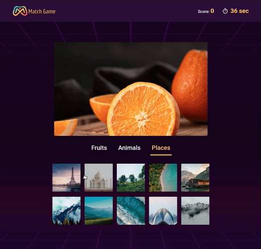
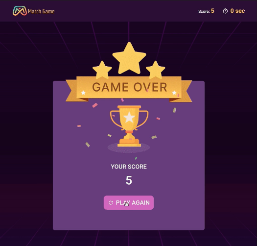

# Match Game App

  
  
  
  

  
  

A fast-paced React game where users match images against thumbnails under time pressure.

Built as part of **Daily Code 2026**, focusing on timers, conditional rendering, game-state management, and controlled UI updates.

---

## 📑 Contents

- Overview
- Features
- Game Logic
- Concepts Practiced
- Screenshots
- Project Structure
- Getting Started
- Tech Stack
- Notes
- Author

---

## 📌 Overview

The Match Game challenges users to quickly identify and match images from a set of categorized thumbnails before time runs out.

The game ends when the timer reaches zero or an incorrect match is selected.

---

## ✨ Features

- Countdown timer starting from 60 seconds
- Dynamic image matching
- Category-based tabs
- Random image generation on correct match
- Score tracking
- Game-over scorecard
- Restart game functionality

---

## 🎮 Game Logic

- Initial state:
  - Score = 0
  - Time = 60 seconds
  - Fruits tab active
- Timer counts down continuously
- On correct thumbnail match:
  - Score increments
  - New image selected randomly
- On incorrect match or time expiry:
  - Game ends
  - Scorecard view is displayed
- Clicking **PLAY AGAIN**:
  - Resets score, timer, active tab, and match image

---

## 🧠 Concepts Practiced

- State management for games
- Timer handling with intervals
- Conditional rendering
- Randomized data selection
- Parent–child component communication
- Controlled tab-based filtering

---

## 🖼️ Screenshots

---

## 📁 Project Structure

src/
├── components/
│   ├── MatchGame/
│   │   ├── index.js
│   │   └── index.css
│   ├── TabItem/
│   ├── ThumbnailItem/
│   └── ScoreCard/
├── App.js
└── index.js

---

## 🚀 Getting Started

Install dependencies:

    npm install

Start the development server:

    npm start

Runs at: http://localhost:3000

---

## 🛠️ Tech Stack

- React (Create React App)
- JavaScript (ES6+)
- CSS

---

## 📌 Notes

- Timer must stop cleanly on game over
- Image matching must be exact
- Tabs filter thumbnails by category
- Designed to satisfy strict testing requirements

---

## 👤 Author

Built as part of **Daily Code 2026**
Maintained by **Guneshbari**

