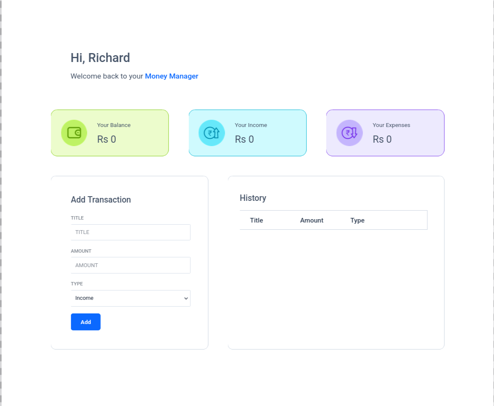
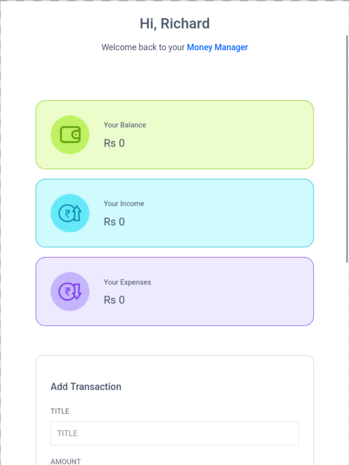

# Money Manager App

  
  
  
  

  
  

A React application that helps users track income, expenses, and balance by managing a list of financial transactions.

Built as part of **Daily Code 2026**, focusing on form handling, derived state calculations, and list-based state management.

---

## 📑 Contents

- Overview  
- Features  
- App Logic  
- Concepts Practiced  
- Screenshots  
- Project Structure  
- Getting Started  
- Tech Stack  
- Notes  
- Author  

---

## 📌 Overview

The Money Manager App allows users to add income and expense transactions and automatically calculates total income, total expenses, and the current balance.

This project reinforces how derived values can be calculated from state and updated consistently in React.

---

## ✨ Features

- Add income and expense transactions  
- Display transaction history  
- Automatically calculate:
  - Total income
  - Total expenses
  - Current balance  
- Delete transactions from history  
- Controlled inputs with reset after submission  

---

## 🎯 App Logic

- Initial values:
  - Balance Amount = 0  
  - Income Amount = 0  
  - Expenses Amount = 0  

- Calculations:
  - totalIncome = sum of all income transactions  
  - totalExpenses = sum of all expense transactions  
  - totalBalance = totalIncome - totalExpenses  

- On adding a transaction:
  - Transaction is added to history
  - Totals are recalculated
  - Inputs reset to initial values

- On deleting a transaction:
  - Transaction is removed from history
  - Totals are recalculated

---

## 🧠 Concepts Practiced

- Controlled form elements  
- React state management  
- Derived state calculations  
- List rendering with unique keys  
- Event handling  
- Parent–child communication via props  

---

## 🖼️ Screenshots

  
  

---

## 📁 Project Structure

src/
├── components/
│   ├── MoneyManager/
│   │   ├── index.js
│   │   └── index.css
│   ├── MoneyDetails/
│   │   ├── index.js
│   │   └── index.css
│   └── TransactionItem/
│       ├── index.js
│       └── index.css
├── App.js
└── index.js

---

## 🚀 Getting Started

Install dependencies:

npm install

Start the development server:

npm start

Runs at: http://localhost:3000

---

## 🛠️ Tech Stack

- React (Create React App)  
- JavaScript (ES6+)  
- CSS  
- Testing Library  

---

## 📌 Notes

- Balance Amount must have `data-testid="balanceAmount"`  
- Income Amount must have `data-testid="incomeAmount"`  
- Expenses Amount must have `data-testid="expensesAmount"`  
- Delete button must have `data-testid="delete"`  
- Designed to satisfy strict testing requirements  

---

## 👤 Author

Built as part of **Daily Code 2026**  
Maintained by **Guneshbari**

