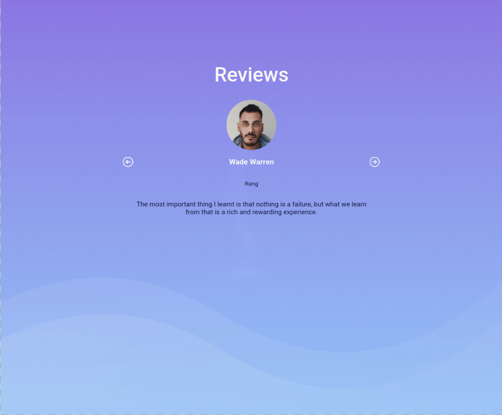

# Reviews App

  
  
  
  

  
  

A React application that displays user reviews and allows navigation between them.

Built as part of **Daily Code 2026**, focusing on state management, event handling, and conditional rendering.

---

## 📑 Contents

- Overview  
- Features  
- Review Logic  
- Concepts Practiced  
- Screenshots  
- Project Structure  
- Getting Started  
- Tech Stack  
- Notes  
- Author  

---

## 📌 Overview

The Reviews App displays one review at a time and allows users to navigate through multiple reviews using buttons.

This project reinforces how React manages state changes and conditional UI updates based on user interaction.

---

## ✨ Features

- Displays user reviews dynamically  
- Navigate between reviews using buttons  
- Handles edge cases when navigating beyond limits  
- Clean and focused user interface  

---

## 🎯 Review Logic

- Reviews are stored as a list of objects
- State tracks the current review index
- Navigation buttons update the index
- UI updates automatically based on the active review

---

## 🧠 Concepts Practiced

- React state management  
- Event handling  
- Conditional rendering  
- List-based data navigation  
- Component-driven UI  

---

## 🖼️ Screenshots

  
  

---

## 📁 Project Structure

src/
├── components/
│   └── Reviews/
├── App.js
└── index.js

---

## 🚀 Getting Started

Install dependencies:

npm install

Start the development server:

npm start

Runs at: http://localhost:3000

---

## 🛠️ Tech Stack

- React (Create React App)  
- JavaScript (ES6+)  
- CSS  
- Testing Library  

---

## 📌 Notes

- Designed to satisfy strict testing requirements  
- Focused on predictable state-driven UI behavior  
- Emphasizes clarity over visual complexity  

---

## 👤 Author

Built as part of **Daily Code 2026**  
Maintained by **Guneshbari**

