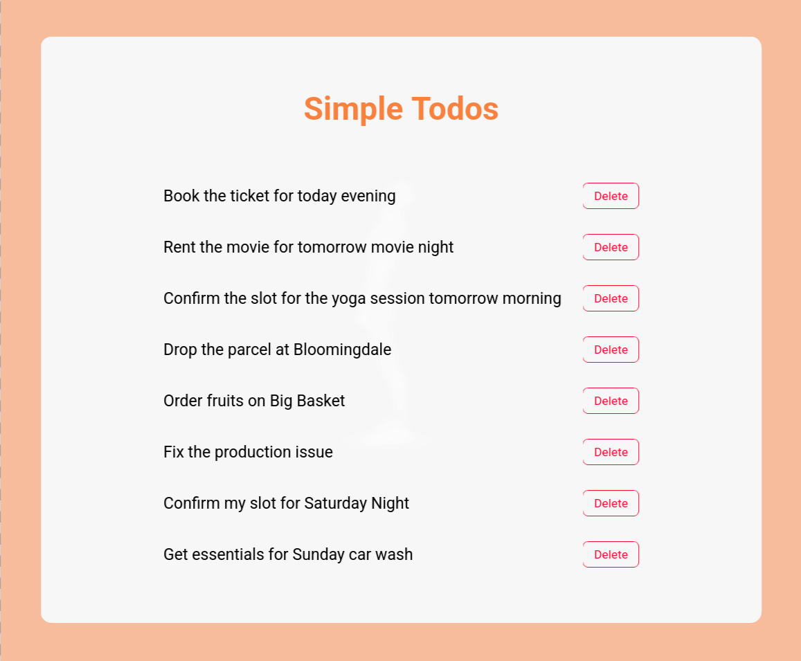
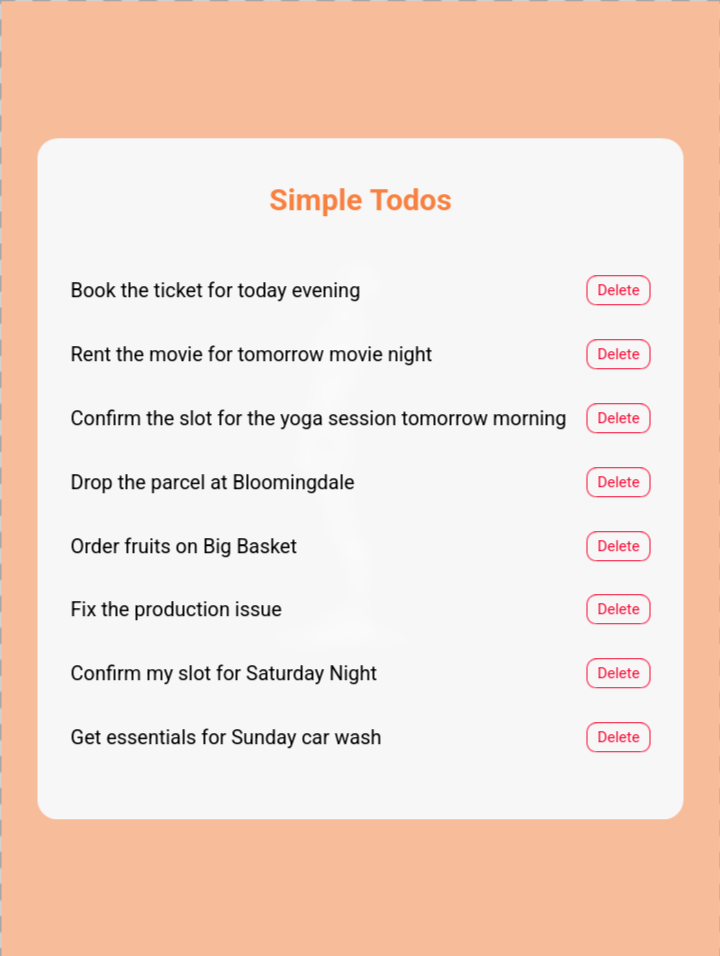

# Browser History App

<p align="center">
  
  
  
  
</p>

<p align="center">
  
  
</p>

A React application that displays browser history items, supports searching through them, and allows deleting individual entries.

Built as part of **Daily Code 2026**, focusing on list manipulation, controlled inputs, and predictable state updates.

---

## 📑 Contents

- [Overview](#-overview)
- [Features](#-features)
- [Concepts Practiced](#-concepts-practiced)
- [Screenshots](#-screenshots)
- [Project Structure](#-project-structure)
- [Getting Started](#-getting-started)
- [Tech Stack](#-tech-stack)
- [Notes](#-notes)
- [Author](#-author)

---

## 📌 Overview

The Browser History App renders a list of visited websites and allows users to filter the list using a search input.  
Each history item can be deleted individually, with the UI updating instantly.

This project reinforces correct list handling patterns in React.

---

## ✨ Features

- Displays browser history items on initial load
- Case-insensitive search functionality
- Delete individual history entries
- Real-time UI updates
- Clean and readable interface

---

## 🧠 Concepts Practiced

- Controlled input elements
- Array filtering and deletion
- List rendering with unique keys
- Parent–child communication via props
- Callback-based state updates

---

## 🖼️ Screenshots





---

## 📁 Project Structure

src/
├── components/
│ ├── BrowserHistory/
│ └── HistoryItem/
├── App.js
└── index.js


---

## 🚀 Getting Started

### Install dependencies
```bash
npm install

Start the development server

npm start

Runs at: http://localhost:3000
🛠️ Tech Stack

    React (Create React App)

    JavaScript (ES6+)

    CSS

    Testing Library

📌 Notes

    State updates are handled immutably

    Search and delete logic is derived from state

    Designed to meet strict testing requirements

    Focused on correctness and clarity

👤 Author

Built as part of Daily Code 2026
Maintained by Guneshbari

