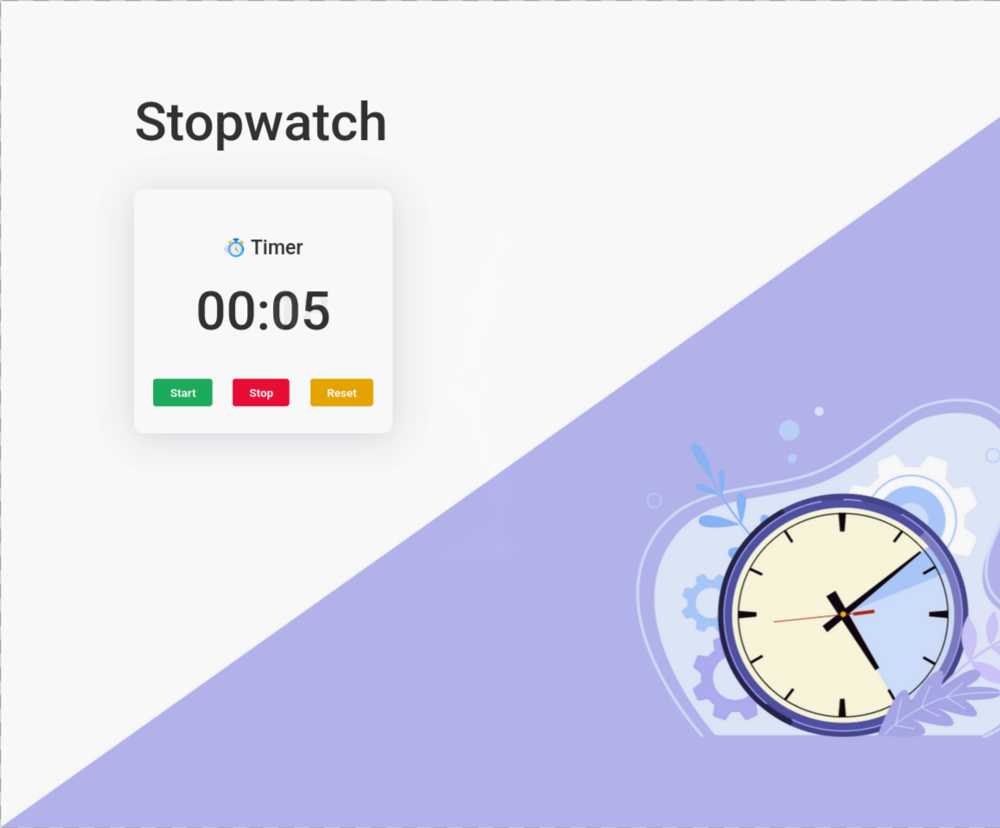

# Stopwatch App

  
  
  
  

  
  

A simple React application that implements a stopwatch with start, stop, and reset functionality.

Built as part of **Daily Code 2026**, focusing on timers, interval management, and event-driven state updates.

---

## 📑 Contents

- Overview
- Features
- Stopwatch Logic
- Concepts Practiced
- Screenshots
- Project Structure
- Getting Started
- Tech Stack
- Notes
- Author

---

## 📌 Overview

The Stopwatch App allows users to measure elapsed time using basic stopwatch controls.

This project reinforces handling time-based logic in React using intervals and proper cleanup.

---

## ✨ Features

- Start the stopwatch
- Stop the stopwatch
- Reset the stopwatch to zero
- Real-time time updates
- Clean and minimal UI

---

## ⏱️ Stopwatch Logic

- When **Start** is clicked:
  - Stopwatch begins running
- When **Stop** is clicked:
  - Stopwatch pauses at the current time
- When **Reset** is clicked:
  - Stopwatch resets to `00:00`

The stopwatch updates time using interval-based state changes.

---

## 🧠 Concepts Practiced

- React state management
- setInterval and clearInterval
- Event handling
- Conditional rendering
- Component lifecycle awareness

---

## 🖼️ Screenshots

---

## 📁 Project Structure

src/
├── components/
│   └── Stopwatch/
│       ├── index.js
│       └── index.css
├── App.js
└── index.js

---

## 🚀 Getting Started

Install dependencies:

    npm install

Start the development server:

    npm start

Runs at: http://localhost:3000

---

## 🛠️ Tech Stack

- React (Create React App)
- JavaScript (ES6+)
- CSS

---

## 📌 Notes

- Stopwatch must start, stop, and reset correctly
- Interval cleanup is important to avoid memory leaks
- Designed to satisfy strict testing requirements

---

## 👤 Author

Built as part of **Daily Code 2026**
Maintained by **Guneshbari**

